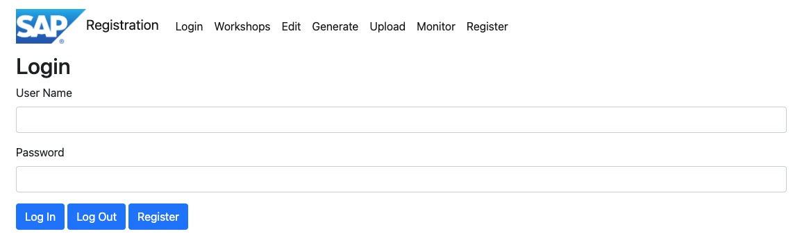
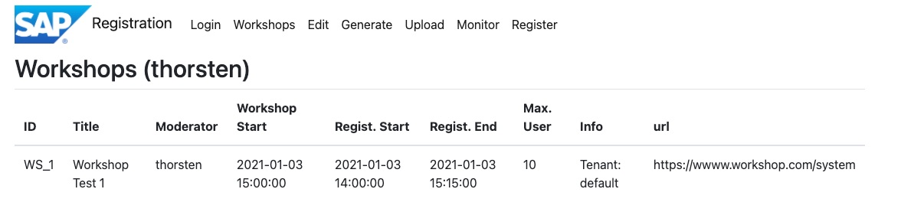
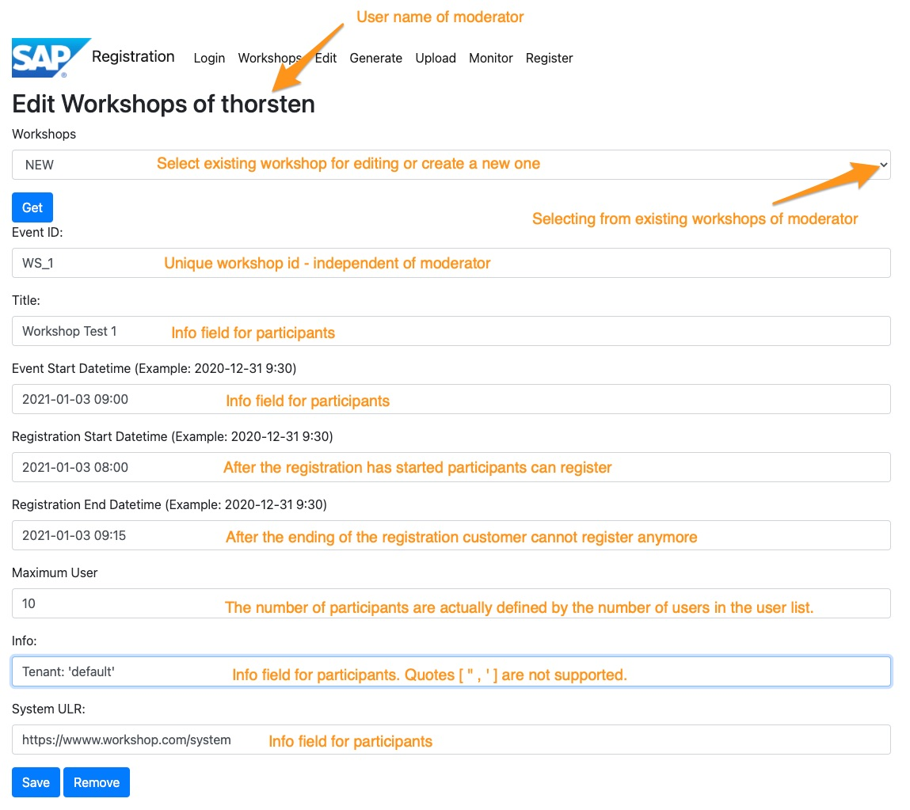
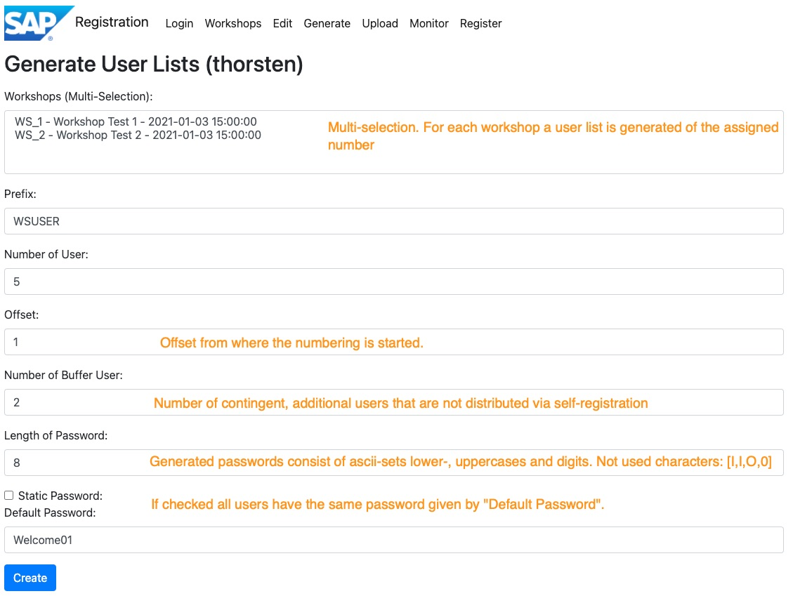
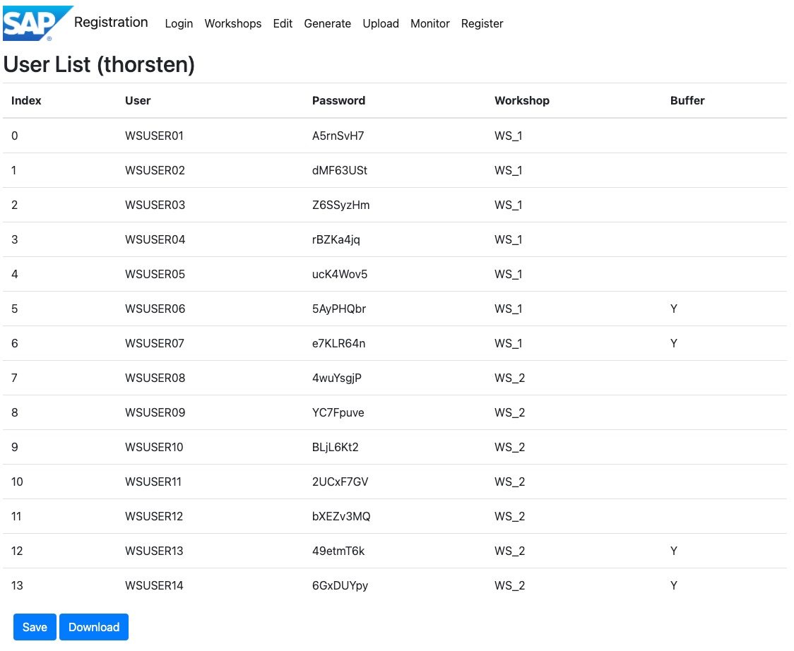
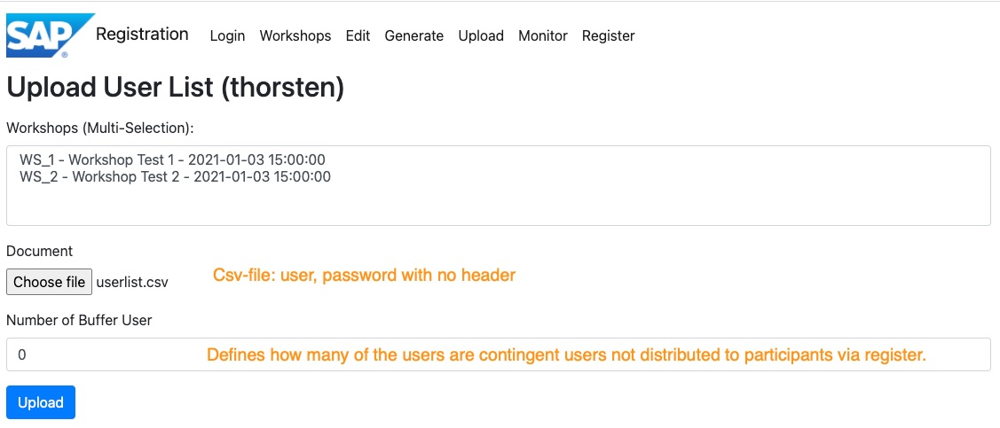
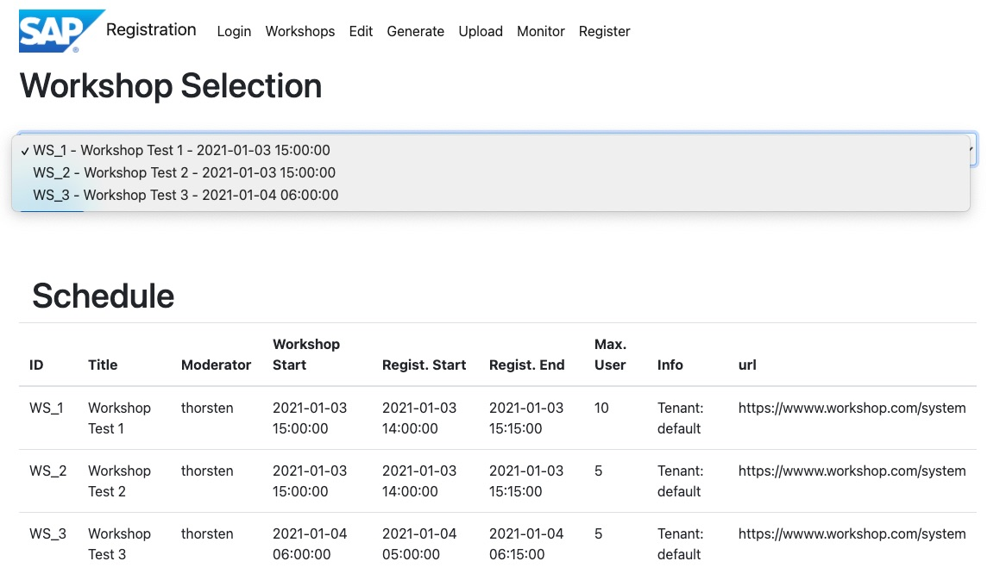
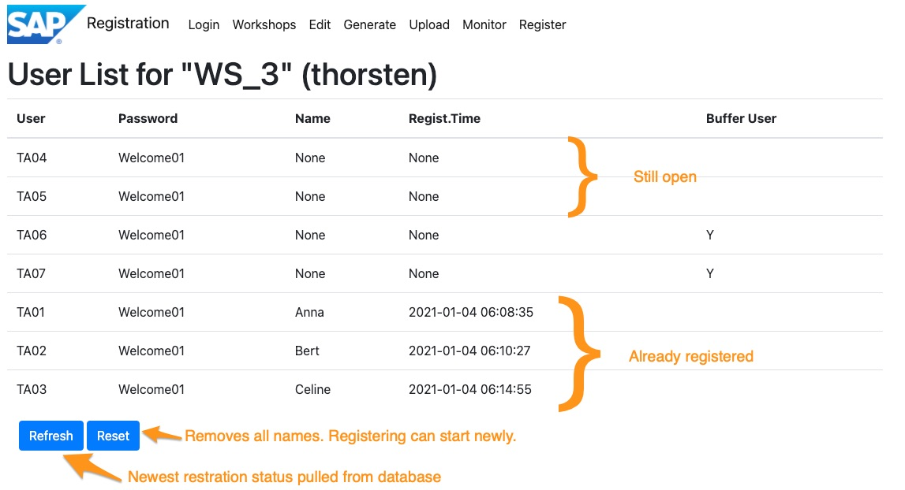
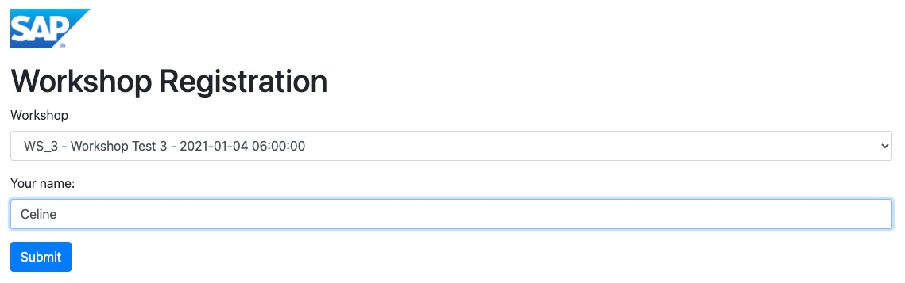
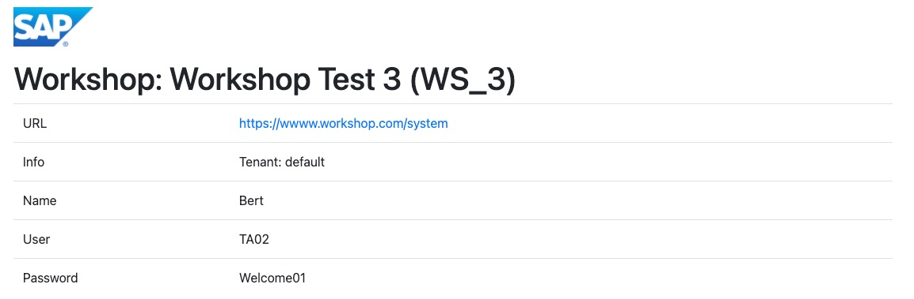

# Workshop Registration

This application let you setup workshops and provides a registration page for workshop participants to retrieve their credentials.
This avoids that at the beginning of a workshop the moderator had to hand the information to each participant manually. The
developement was triggered by the SAP TechEd2020 when all workshops went virtual but is not an SAP product. 

There are two kinds of access:
* Moderator for setting up workshops and monitoring the registration 
    * Login - register newly as moderator and login,logout
    * Workshops - lists all your workshops 
    * Edit - Create a new workshop or edit the existing workshops
    * Generate - Generate a user list with dynamic or static passwords for each workshop
    * Upload - Upload user list for a workshop 
    * Monitor - Monitor the users who have registered to the workshop
* Participants
    * Register - registering for workshop and getting the credentials provided there are open places
    

# Usage

## Moderator

### Login ( .../login )
 

Every moderator has in the first place to register with username and password - nothing more is required to create workshops
 and userlists. She furthermore can only create and edit her own workshops and corresponding user lists. 

### Workshops (../index)

Overview of all workshops. 

 

### Edit (../edit)

Enables to create, change or delete workshops.



### Generate (../generate)

Generates a user list with passwords.  



User list has to be saved in order to be distributed for the registration of participants. 
The downloaded user list can be used to automatically create the user in the workshop system. 



### Upload (../upload)

Enables to upload users that might have already been setup in system used for the workshop.



### Monitor

During the registration time (registration_start - registration_end) the moderator may want to have a snapshot how many 
users might have registered already. 





## Participant

### Register






# Technical details
The data is stored currently in a HANA Cloud database and the HDBCLI-client is used to connect to the database. Although
preferring kind of standards, SQLAlchemy was not used. Maybe in future I give it a try and use the
[SQLAlchemy dialect for SAP HANA](https://github.com/SAP/sqlalchemy-hana/blob/master). In this case it would be easier to
replace HANA with a another DB, for what no real reason exists ;).

There are 3 tables: 

* WORKSHOPS: workshop details (foreign key: *MODERATOR*)
* USERS: List of users for each workshop (foreign key: *WORKSHOP_ID*)
* MODERATORS: moderators with credentials (hashed password)

## Table WORKSHOPS
```
CREATE COLUMN TABLE "DIREGISTER"."WORKSHOPS"(
	"ID" NVARCHAR(15),
	"TITLE" NVARCHAR(150),
	"MAX_USER" INTEGER,
	"URL" NVARCHAR(500),
	"WORKSHOP_START" LONGDATE,
	"REGISTRATION_START" LONGDATE,
	"REGISTRATION_END" LONGDATE,
	"INFO" NVARCHAR(150),
	"MODERATOR" NVARCHAR(50),
	PRIMARY KEY (
		"ID"
	)
)
```

## Table USERS
```
CREATE COLUMN TABLE "DIREGISTER"."USERS"(
	"WORKSHOP_ID" NVARCHAR(30),
	"USER" NVARCHAR(20),
	"PWD" NVARCHAR(16),
	"USERNAME" NVARCHAR(25),
	"REGISTRATION_DATE" LONGDATE,
	"BUFFER_USER" NVARCHAR(1)
)
```

## Table MODERATORS
```
CREATE COLUMN TABLE "DIREGISTER"."MODERATORS"(
	"USERNAME" NVARCHAR(30),
	"PWDHASH" NVARCHAR(128),
	"EMAIL" NVARCHAR(100),
	"REGISTRATION_DATE" LONGDATE,
	PRIMARY KEY (
		"USERNAME"
	)
)

```